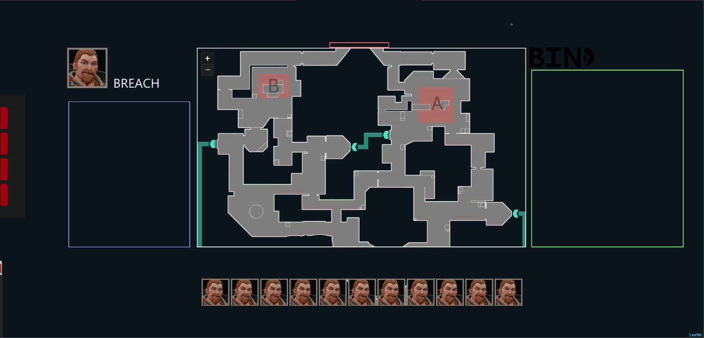

# Hello World

Finally adding a little blog onto the portfolio site.
As temping as it is to go down the wordpress route, there is something
nice about having a simple markdown post system hosted on GitHub Pages. 

Better yet, its free.

## In the Works
* Garden Table DIY Project
* Valorant Linueps Reworks
* MTB Upgrades

### Garden Table DIY Project
This has been great fun to sink my teeth into proper DIY. I hadn't really done anything like this before. Essentially, last year I'd bought a charcoal oil drum BBQ, and without a nice table to sit at outdoors, it wasn't the best sitting with nice food... On a step. So I made my own garden table and benches.

### Valorant Lineups Reworks
Having been handed tremendous feedback from my honours project supervisor. I've been keen to get back to work with the project. I've always envisioned how I would rework the overall user-interface for a more friendly experience. I'm keen to tie it into Riot's Valorant API to describe overall winrates for certain agents on certain maps too. I'll be launching it on a live domain soon, watch this space.

### MTB Upgrades
In the back of all the buzz between the DIY and my Valorant Lineups project, I've been keen at looking for new parts for my mountainbike. In part for more comfort whilst riding, and to improve its look.I think I could get used to having this sort of ease of commute more often :D

